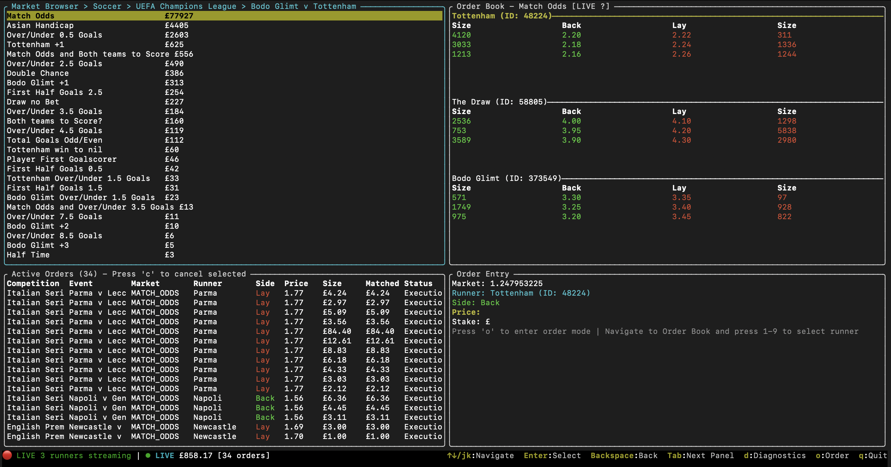

# Betfair in Rust

[](https://github.com/t2o2/betfair-rs/actions/workflows/unit_tests.yml)

A high-performance Rust library for interacting with the Betfair Exchange API, featuring real-time market data streaming, order management, and an interactive terminal dashboard for trading.

## Setup

Need to convert the cert and key files that were uploaded to betfair to pkcs12 format

```bash
openssl pkcs12 -export -out client.pfx -inkey client.key -in client.crt
```

Configuration are expected to be set in a `config.toml` file containing the following.

```toml
[betfair]
username = ""
password = ""
api_key = ""
pfx_path = "[absolute path]"
pfx_password = ""
```

## Quick Start

### Running the Interactive Dashboard

The library includes a powerful interactive terminal dashboard for real-time trading:

```bash
# Using cargo run
cargo run -- dashboard

# Or after building
./target/debug/betfair dashboard
```



The dashboard provides:
- **Real-time market browser** with live price updates
- **Interactive orderbook** with bid/ask ladder visualization
- **Active order management** with one-click cancellation
- **Quick order placement** with keyboard shortcuts
- **Account balance tracking** and P&L monitoring
- **Vim-style navigation** (hjkl, Tab to switch panels)

### Key Bindings

- `Tab`/`Shift+Tab` - Navigate between panels
- `j/k` or `↑/↓` - Move up/down in lists
- `h/l` or `←/→` - Navigate horizontally (in order entry)
- `Enter` - Select market/confirm order
- `o` - Enter order placement mode
- `c` - Cancel selected order
- `r` - Refresh market data
- `?` - Show help
- `q` - Quit application

## Architecture

The library provides a unified client architecture:

### UnifiedBetfairClient
- Combines REST API and streaming capabilities in a single client
- JSON-RPC based REST API operations
- Real-time WebSocket streaming for market data
- Built-in rate limiting per endpoint type (navigation/data/transaction)
- Automatic retry with exponential backoff
- Shared session token management
- Flexible market filtering with optional parameters

### Component Clients (for advanced usage)
- **BetfairApiClient**: REST API operations only
- **StreamingClient**: Real-time streaming only (can accept external session token)

## Features

### Streaming Capabilities

The library provides real-time market data streaming through Betfair's streaming API with non-blocking architecture:

```rust
use betfair_rs::{Config, UnifiedBetfairClient};

// Initialize the unified client
let config = Config::new()?;
let mut client = UnifiedBetfairClient::new(config);

// Login (handles both REST and streaming authentication)
client.login().await?;

// Start streaming
client.start_streaming().await?;

// Subscribe to markets for real-time updates
client.subscribe_to_market("1.241529489".to_string(), 3).await?;

// Access streaming orderbooks
if let Some(orderbooks) = client.get_streaming_orderbooks() {
    let books = orderbooks.read().unwrap();
    // Process orderbook data
}
```

The streaming implementation includes:
- Non-blocking architecture for real-time updates
- Real-time orderbook updates with price levels
- Automatic heartbeat monitoring and reconnection
- Support for multiple market subscriptions
- Configurable orderbook depth (1-10 levels)
- Thread-safe orderbook state management
- Direct subscription management for improved performance

### Order Management

The library provides comprehensive order management capabilities:

#### Order Placement and Cancellation

```rust
use betfair_rs::{Config, UnifiedBetfairClient, dto::order::*, dto::common::Side};

// Initialize the unified client
let config = Config::new()?;
let mut client = UnifiedBetfairClient::new(config);
client.login().await?;

// Place a back order
let market_id = "1.240634817";
let instruction = PlaceInstruction {
    order_type: OrderType::Limit,
    selection_id: 39674645,
    side: Side::Back,
    limit_order: Some(LimitOrder {
        size: 10.0,
        price: 2.5,
        persistence_type: PersistenceType::Lapse,
        ..Default::default()
    }),
    ..Default::default()
};

let request = PlaceOrdersRequest {
    market_id: market_id.to_string(),
    instructions: vec![instruction],
    ..Default::default()
};

let order_response = client.place_orders(request).await?;

// Cancel the order if it was placed successfully
if let Some(report) = order_response.instruction_reports.and_then(|r| r.first()) {
    if let Some(bet_id) = &report.bet_id {
        let cancel_request = CancelOrdersRequest {
            market_id: Some(market_id.to_string()),
            instructions: Some(vec![CancelInstruction {
                bet_id: bet_id.clone(),
                size_reduction: None,
            }]),
            ..Default::default()
        };
        let cancel_response = client.cancel_orders(cancel_request).await?;
        println!("Order canceled: {:?}", cancel_response);
    }
}
```

#### List Current Orders

```rust
// Get current orders
let request = ListCurrentOrdersRequest {
    bet_ids: None,
    market_ids: None,
    order_projection: Some(OrderProjection::All),
    ..Default::default()
};

let current_orders = client.list_current_orders(request).await?;

// Process order information including:
// - Execution status
// - Matched/remaining amounts
// - Price information
```

### Account Management

```rust
// Get account funds information
let request = GetAccountFundsRequest {
    wallet: None,
};
let account_funds = client.get_account_funds(request).await?;

// Access account details including:
// - Available balance
// - Exposure
// - Exposure limits
// - Discount rates
// - Points balance
// - Wallet information

// Get account details
let account_details = client.get_account_details().await?;
```

## Example

The main example application is the interactive dashboard:
- `examples/dashboard.rs` - Full-featured terminal dashboard with real-time trading, market browsing, order management, and account monitoring

## Performance

The library is built for high-performance trading with:
- Asynchronous I/O using Tokio
- Rate limiting to respect API limits
- Efficient JSON parsing with Serde
- Non-blocking streaming architecture
- Minimal memory allocations in hot paths

## Testing

```bash
# Run all tests
cargo test

# Run library tests only (no credentials required)
cargo test --lib

# Run specific test
cargo test test_name
```

## License

[Add your license information here]
